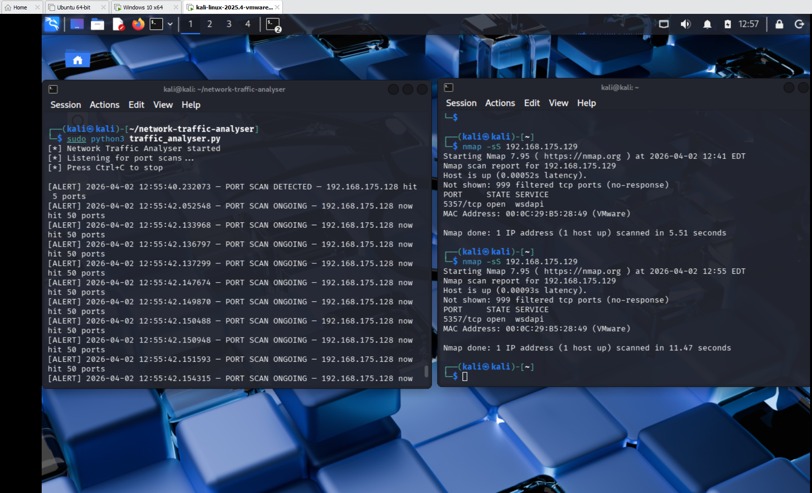
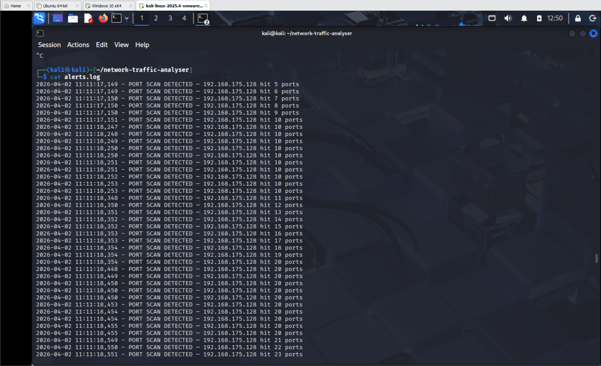
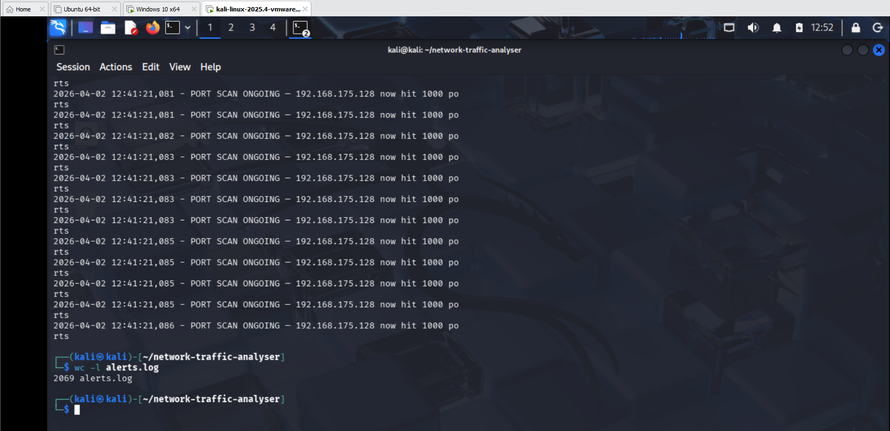

# Network Traffic Analyser

## Overview
A Python tool that captures live network traffic and automatically detects port scan activity in real time. Built using Scapy, the tool monitors TCP SYN packets, identifies when a single IP hits multiple ports, and fires alerts to both the terminal and a log file.

## How It Works
1. Scapy sniffs all TCP packets on the network interface
2. Every SYN packet (connection attempt) is recorded - source IP and destination port
3. If one IP hits 5 or more ports - a PORT SCAN DETECTED alert fires
4. Every 50 additional ports after that - a PORT SCAN ONGOING alert fires
5. All alerts are saved to alerts.log with timestamps

## Requirements
- Python 3
- Scapy (`sudo apt install python3-scapy`)
- Root/sudo privileges (required for packet capture)
- Linux (tested on Kali Linux 2025.4)

## Usage
```bash
sudo python3 traffic_analyser.py
```

Run in one terminal while generating traffic in another:
```bash
nmap -sS <target-ip>
```

## Detection Logic

| Event | Trigger | Alert Type |
|---|---|---|
| Port scan start | 1 IP hits 5 different ports | PORT SCAN DETECTED |
| Port scan ongoing | Every 50 additional ports | PORT SCAN ONGOING |

## Sample Output
```
[*] Network Traffic Analyser started
[*] Listening for port scans...
[*] Press Ctrl+C to stop

[ALERT] 2026-04-02 12:55:40 — PORT SCAN DETECTED — 192.168.175.128 hit 5 ports
[ALERT] 2026-04-02 12:55:42 — PORT SCAN ONGOING — 192.168.175.128 now hit 50 ports
[ALERT] 2026-04-02 12:55:42 — PORT SCAN ONGOING — 192.168.175.128 now hit 100 ports
```

## Log File
All alerts are saved to `alerts.log` in the same directory:
```
2026-04-02 12:55:40 - PORT SCAN DETECTED — 192.168.175.128 hit 5 ports
2026-04-02 12:55:42 - PORT SCAN ONGOING — 192.168.175.128 now hit 50 ports
```

## Screenshots

| Screenshot | Description |
|---|---|
|  | Live port scan detection in terminal |
|  | Alerts saved to log file |
|  | 2069 alerts logged across test runs |

## Key Learnings
- TCP SYN packets are the fingerprint of a port scan — every connection attempt sends one
- Scapy gives full access to raw packets at the network level in just a few lines of Python
- Port scan detection is fundamentally about tracking behaviour over time, not individual packets
- Logging alerts to file is essential in a real SOC environment for forensic analysis

## Environment
- OS: Kali Linux 2025.4
- Python: 3.13.9
- Scapy: 2.6.1
- Network interface: eth0
- Test target: Windows 10 VM (192.168.175.129)
